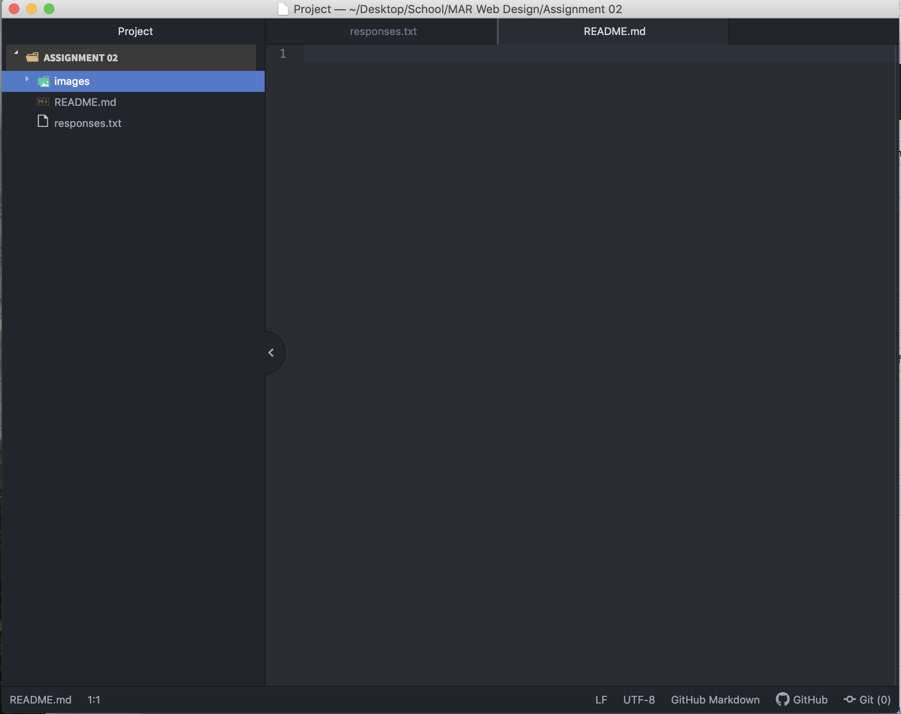

# Assignment-02
## Brittany Streissguth

I decided to take this class because I run a blog and wanted to know more about the backend of my website and how to potentially fix problems if they arise, or  begin learning how to create a website down the road!

3 Things I've Learned/Hope To Learn:
1. That the internet is actually all connected with wires.
2. That coding is a very complicated language.
3. How to create a foundation to continue to learn how to build a website.

[Pumps and Plaid](https://www.pumpsandplaid.com)

[Response File](./responses.txt)

