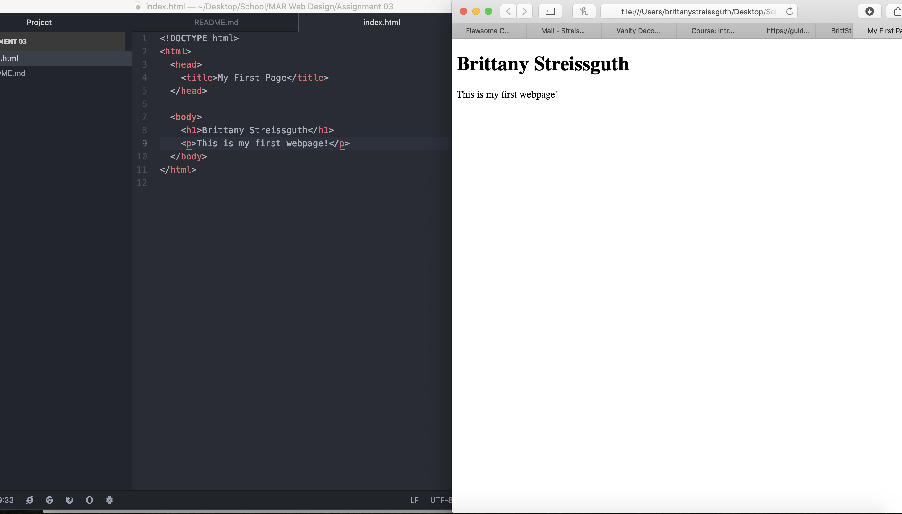

# Assignment-03
## Brittany Streissguth

1. Browsers function by first interpreting a request that has been sent from a server. They are made up of a user interface, rendering engine, browser engine, network, programming language, and data storage. I mostly use Safari, but have found that it doesn't always like to load pages, so I defer to Chrome.
2. A markup language is the "architecture" of the page. One commonly used in development, that we will be using in this class is HTML.

