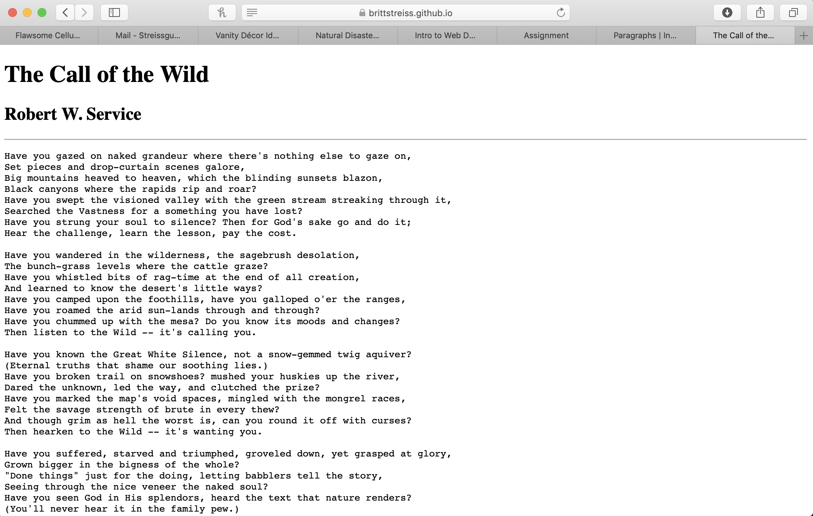

# Assignment 04
## Brittany Streissguth

1. The Wayback Machine is hilarious. I decided to visit MySpace 10 years ago and it was much different. I wasn't even sure if it was still a website, and it very much is, but it looks like now it's used for a way for music artists to be discovered, as well as a place for all things pop culture. In 2009 it was used for music, and pop culture news was making it's way there, but it was mostly a social media site where each person constructed their own unique page.
2. My experience with the GIT Module was slow but sure. I thin I'm getting the hang of it, and its fun to move quicker through things! I don't think it's difficult, there are just lots of details to remember.

