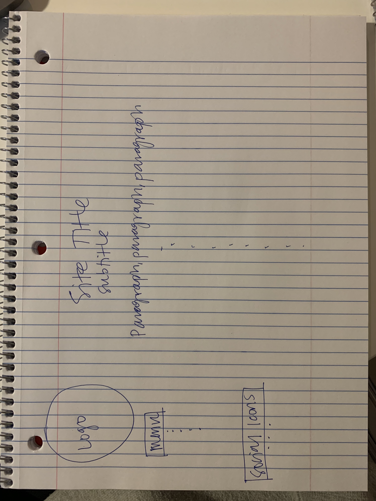

#Brittany Streissguth
##Assignment 11 - positioning

1. The difference between padding, margin, and borders is:
Padding: how much space is between an element and its border.
Margin: how much space between edges of elements.
Border: the outside edge of an element (box- even if the lines of the "box" are invisible).

2. 

3. I started by doing a simple sketch of what I wanted my site to look like. I started with the "menu" or "page navigation" items, uploaded a fake logo, and aligned the left column of my page as best I could. I then added some mock content to the main part of my site. I went back and forth quite a bit trying to decide if I should make the Menu links a list or not, and how to differentiate between id's and classes. It seems there are lots of ways to go about doing the same thing, and it's hard to know which you "should" do.
I'm still working on my understanding of applying margins and padding when appropriate and how to achieve position relative to another element.
